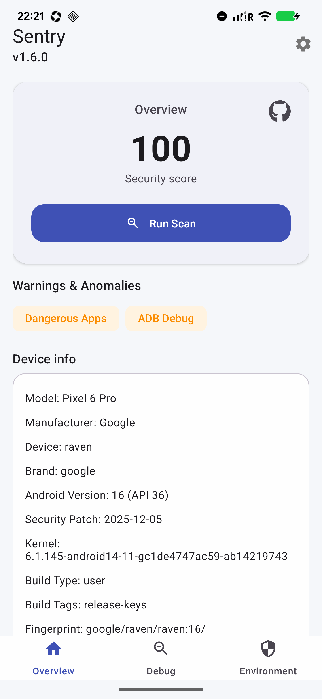
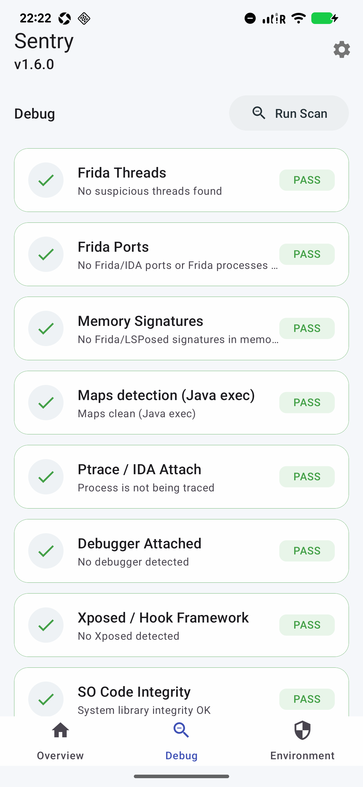
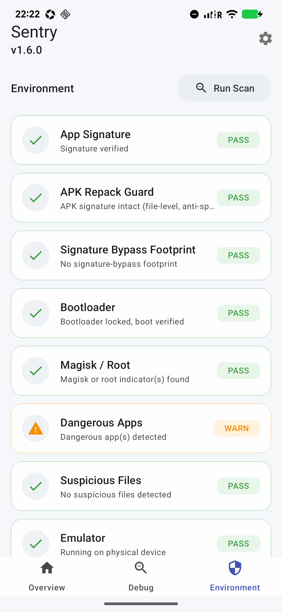
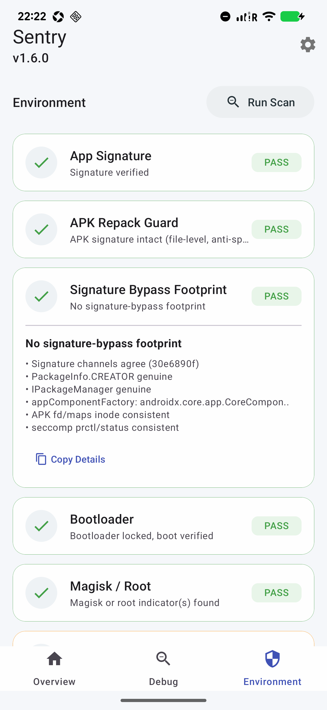

# Sentry · Android 运行时安全检测引擎

面向风控与移动安全研究的多信号本地检测引擎：Java 编排 + Native 对抗，syscall 优先、多通道交叉验证，将结论做成可解释、可量化的运行时画像。

- 23 项检测，分调试域 11 + 环境域 12，状态三态 `NORMAL` / `WARNING` / `DANGER`
- 调试域统一施加 **1.5× 权重**，`warnOnly` 仅提示不扣分
- 仅构建 `arm64-v8a`，最低 Android 7（API 24），目标 Android 16（API 36）
- 完整规格见 [`doc/DETECTION_SPEC.md`](doc/DETECTION_SPEC.md)

---

## 📢 关注公众号

> 更多 **Android 安全 / 逆向 / 风控对抗** 干货与本项目更新，第一时间推送。微信搜索关注 👇

<p align="center">
  
</p>

---

## 界面预览

| 概览 | 调试检测 |
|:---:|:---:|
|  |  |

| 环境检测 | 详细页 |
|:---:|:---:|
|  |  |

---

## 检测覆盖面

**调试域 · 11 项**：Frida 线程 / Frida 端口与进程 / 内存与 maps 签名 / Java exec 通道 maps / ptrace 与调试器附加 / Debug.isDebuggerConnected / Xposed·Hook 框架（含 **ClassLinker `class_loaders_` 计数**，对抗 maps 隐藏） / SO 代码段完整性 / ArtMethod entry / SIGTRAP Hook 陷阱 / 脏页与内存注入。

**环境域 · 12 项**：App 签名校验（PackageManager） / **APK 防改包·反签名伪装（文件级解析 v2/v3 签名块）** / Bootloader + Key Attestation RootOfTrust / Magisk·Root / 危险应用（warnOnly） / 可疑路径 / 模拟器 / **云手机·传感器/硬件真实性（传感器数量与厂商、电池温压）** / 内核补丁陈旧度（warnOnly） / ADB 多通道（warnOnly） / 多开 / 容器与 cgroup。

每项的原理、命中条件、代码位置、权重、`warnOnly`、平台限制与已知误报场景见 [`doc/DETECTION_SPEC.md`](doc/DETECTION_SPEC.md)。

---

## 技术深度

### 1. 双引擎与生命周期闸门

敏感逻辑下沉 Native（`libantidebug` / `libenvdetect`），Java 侧负责调度与展示。Release 构建下将当前 APK 签名 **SHA-256** 与构建期注入的期望值在 Native 层比对；不匹配时在应用最早阶段（`Application.onCreate`）终止，缩小 UI / 业务层绕过窗口。

### 2. syscall 优先 + libc 回退

读 `/proc`、套接字探测等热路径直接走 `svc` 指令（`open` / `read` / `connect` / `setsockopt` / `tgkill` / …），减少对 libc 常规导出符号的依赖，降低 Frida / Xposed 对 libc 一刀切 Hook 带来的系统性失效。受限机型上配合 syscall → libc 的 fallback，兼顾对抗强度与兼容性。

### 3. 多通道：不把可信度绑在单一 API

- **Maps**：Native syscall 直读 `/proc/<pid>/maps` + Java `Runtime.exec("cat ...")` 二次扫描，对抗只 patch 一条读路径的绕过。
- **ADB**：Native（端口直连、`/proc/net/tcp` 行内 LISTEN 匹配、`adbd` 进程扫描、sysfs USB 状态）+ Java Settings + `getprop` / `settings get` exec 兜底，绕过 ContentResolver Hook。
- **Bootloader**：`ro.boot.*` 属性 + Key Attestation 证书链中的 RootOfTrust（`deviceLocked` / `verifiedBootState` / `verifiedBootKey` / `verifiedBootHash`），属性覆盖面广、TEE 侧证据置信度高。
- **Xposed / Hook**：Java（类名 / 堆栈 / 反射 / `ClassLoader` 实例指纹）与 Native（特征路径 / `/proc/self/fd` / inline + PLT·GOT / 可疑匿名 r-x / ARM64 LR）组合，避免「只盯 Java 或只盯 maps」的盲区。

### 4. Frida 工程级覆盖

除 27042 / 23946 等默认端口与 `/proc/net/tcp` LISTEN 解析外，覆盖 Frida 16+ 随机端口场景——按进程 `comm` 关联其 `/proc/<pid>/net/tcp`、扫描 `re.frida.*` 与 `frida-server` 进程名，并对本机 LISTEN 端口（127.0.0.1 与 0.0.0.0）发短 D-Bus AUTH 探测（典型 REJECT 响应作为强特征），与线程 `comm` 关键词、maps 签名共同构成证据链。

### 5. 内存与映射：不止字符串匹配

在 maps 签名之外，对匿名可执行映射做规模与白名单约束，并扫描 ARM64 上 `LDR X16/X17, [PC, #8]; BR X16/X17` 一类 trampoline 指令序列；对 LSPosed / Zygisk 等「隐藏 so 仍留 r-x」场景保留敏感度。设置中可选「高级检测」降低匿名段大小阈值（默认 128 KB → 4 KB），用更高检出换更高误报压力。

### 6. SO 代码完整性：面向 SELinux / XOM 的现实解法

放弃易踩 SELinux 权限与 Execute-Only Memory 雷区的「读磁盘 code 段做哈希」路径，转而通过 `dl_iterate_phdr` 取本进程加载的 libc 路径与 PT_LOAD/PF_X 段，分块 CRC32 对比磁盘 vs 内存；同时检查 `dlsym(open/read/strcmp)` 的解析地址是否仍在 libc PT_LOAD 范围内（GOT 劫持检测），辅以匿名 r-xp 异常段启发式。不依赖 untrusted_app 直读系统分区也能给出高价值信号。

### 7. ArtMethod 与 Java 层 Hook

通过 JNI 取得 `Activity.onCreate` 的 `jmethodID`（即 ART 中的 `ArtMethod*`），在 ART 语义下读取 entry point（偏移 48 / 56 / 64 视 ART 版本而定），与 `/proc/self/maps` 汇总的合法可执行区间比对。典型 Frida Java hook 会把入口指向 libart / oat 之外的可执行岛，与纯 maps 文本扫描互补。

### 8. SIGTRAP Hook 陷阱

在专用 pthread 内安装 SIGTRAP handler，经 syscall `tgkill(self_pid, self_tid, SIGTRAP)` 仅向本线程发信号，handler 内 `siglongjmp` 跳回。若信号未被自有 handler 消化（典型如 Frida 的 signal chaining 链路吞掉或重排），可作为「异常 handler / inline hook 链」的佐证。专用线程避免 UI 线程跨线程 longjmp 崩溃。

### 9. 脏页与内存注入：smaps + pagemap + VMap

- **smaps**：对 `libart` / `libc` / `libselinux` / `libandroid_runtime` 等关键库的可执行段查看 `Private_Dirty`（正常代码段共享只读，不应有私有脏页）。
- **pagemap soft-dirty (bit 55)**：对 libc `fork` / `vfork` / `signal` 函数所在页查看 COW / 已写痕迹（内核维护，用户态无法伪造）。
- **VMap**：扫 maps 中 anon r-x 段内存内容，搜 `zygisk_module_entry` / `libzygisk.so` / `ZygiskModule` 等字符串。

面向 Zygisk、注入型框架等「落地后必有内存痕迹」的场景，而非单靠包名。pagemap 在多数 untrusted_app 上由内核策略返回 0 化页表，详见 spec。

### 10. 环境与完整性 adjacent

Magisk / Root 路径与 Magisk Manager 包名；Xposed 模块发现把 Java `GET_META_DATA` / Launcher 查询、Native 解析 APK ZIP 中 `assets/xposed_init`（syscall，绕过 metaData Hook）、`modules.list` 读取（需 root）三路打通。容器侧结合包名 vs `/proc/self/cmdline` 不一致、已知容器宿主包名、`/proc/1/cgroup` 含 `lxc`/`docker`/`kubepods` 等信号。

### 11. 评分语义

```
score   = Σ(debug.earned × 1.5) + Σ(env.earned)
max     = Σ(debug.max    × 1.5) + Σ(env.max)
percent = round(100 × score / max)
```

按当前权重满分 **283**：调试域 11×10 ×1.5 = **165**，环境域 15+15+15+12+10+10+10+8+5+5+5+8 = **118**。首页"100"等价 `score/283 == 100%`。

`warnOnly` 在 WARNING 时仍计满分，仅 UI 警示——把"开发机常开 ADB、补丁偏旧、装有 Xposed 模块但不等于正在 hook 本进程"等场景从分数里解耦，减少运营误伤。

权重源在 [`MainActivity.applyDebugScoreWeight`](app/src/main/java/anti/rusda/MainActivity.java)，调整时务必同步 [`doc/DETECTION_SPEC.md`](doc/DETECTION_SPEC.md) 的合计。

---

## 平台覆盖

| 项 | 值 | 说明 |
|---|---|---|
| ABI | `arm64-v8a` | 见 [`app/build.gradle`](app/build.gradle) `abiFilters`。32 位机型会 `UnsatisfiedLinkError` 后 Java 兜底，多数检测显示 Check skipped。 |
| minSdk | 24 | Android 7+ |
| targetSdk | 36 | Android 16 |
| 编译选项 | `-O2 -fvisibility=hidden` | Release 与 Debug 统一 -O2，避免内联差异影响 LR 检测 |
| 页对齐 | `-Wl,-z,max-page-size=16384` | 适配 Android 15+ 16 KB page |

部分检测在现代 Android 上有受限场景（untrusted_app 不可读 `/proc/self/pagemap`、SELinux 拒绝访问 `/data/adb/*` 等），失效条件、回退策略与误报陷阱完整列于 [`doc/DETECTION_SPEC.md` § 平台覆盖与已知限制](doc/DETECTION_SPEC.md#平台覆盖与已知限制)。

---

## 延伸阅读

- [`doc/DETECTION_SPEC.md`](doc/DETECTION_SPEC.md)：23 项检测的完整规格 —— 原理、命中条件、代码位置、权重、`warnOnly`、已知限制、误报场景。
- [`SentryApp.java`](app/src/main/java/anti/rusda/SentryApp.java)：启动期签名 fail-fast 入口。
- [`MainActivity.java`](app/src/main/java/anti/rusda/MainActivity.java)：调度与评分权重源头。
